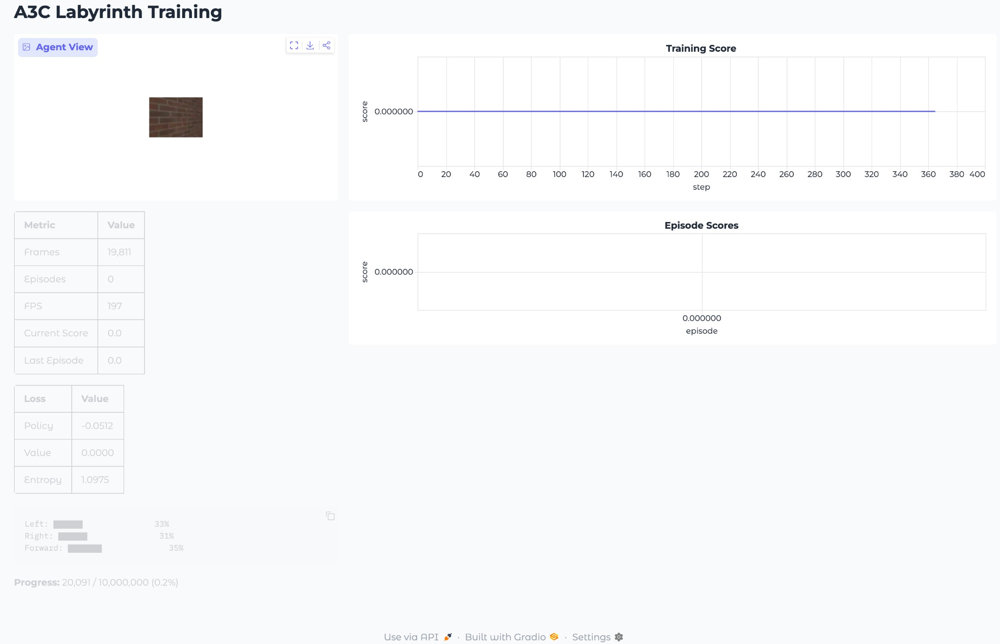

# A3C Labyrinth Navigator

PyTorch implementation of **Asynchronous Advantage Actor-Critic (A3C)** for 3D maze navigation, based on [Mnih et al. 2016](https://arxiv.org/abs/1602.01783).



## Overview

This project trains an agent to navigate randomly generated 3D mazes using only visual input (84×84 RGB). The implementation follows the Labyrinth task from Section 5.4 of the paper:

- **Apples**: +1 reward when collected
- **Portal**: +10 reward, respawns agent, regenerates apples  
- **Episode**: Terminates after 60 seconds

The agent uses an LSTM to maintain memory across time steps, which is preserved across portal jumps but reset on episode termination.

## Architecture

| Layer | Output |
|-------|--------|
| Conv2D (8×8, stride 4) | 16 channels |
| Conv2D (4×4, stride 2) | 32 channels |
| Linear | 256 units |
| LSTMCell | 256 units |
| Actor head | action_space |
| Critic head | 1 |

**Total parameters**: ~1.2M (~5 MB saved)

## Installation

```bash
# Create environment
conda create -n chiefmazi python=3.10
conda activate chiefmazi

# Install dependencies
pip install torch torchvision gymnasium pyglet miniworld gradio pandas
```

## Usage

### Training with Dashboard

```bash
python app.py
```

Opens a Gradio dashboard at `http://localhost:7860` showing:
- Live agent view (84×84)
- Training statistics (frames, episodes, FPS)
- Loss values (policy, value, entropy)
- Action probability distribution
- Score history plots

### Headless Training

```bash
python train.py
```

Prints progress to console without UI overhead.

### Evaluate Trained Model

```python
import torch
from model import A3C_Labyrinth_Net

model = A3C_Labyrinth_Net(action_space=3)
model.load_state_dict(torch.load("checkpoints/a3c_final.pt"))
model.eval()
```

## Project Structure

```
├── model.py          # A3C network with LSTM
├── worker.py         # Async worker process  
├── env_wrapper.py    # Labyrinth task wrapper
├── shared_optim.py   # Shared RMSprop optimizer
├── train.py          # Headless training script
└── app.py            # Gradio dashboard
```

## Hyperparameters

| Parameter | Value | Source |
|-----------|-------|--------|
| Workers | 16 | Section 8 |
| Learning rate | 1e-4 | Section 8 |
| Discount (γ) | 0.99 | Section 8 |
| Entropy weight (β) | 0.01 | Section 8 |
| n-step | 5 | Section 8 |
| Gradient clip | 40.0 | Section 8 |

## Key Implementation Details

1. **Shared memory**: Global model and optimizer statistics are shared across processes using `share_memory()`.

2. **LSTM state management**: Hidden state is detached at each update, reset on episode end, but preserved across portal jumps.

3. **Asynchronous updates**: Workers compute gradients locally and accumulate them to the global model without locks (Hogwild-style).

4. **Spawn vs Fork**: Uses `spawn` multiprocessing on macOS for OpenGL compatibility.

## Requirements

- Python 3.10+
- PyTorch 2.0+
- Gymnasium
- MiniWorld
- Gradio 4.0+
- Display (for MiniWorld rendering)

## Citation

```bibtex
@inproceedings{mnih2016asynchronous,
  title={Asynchronous methods for deep reinforcement learning},
  author={Mnih, Volodymyr and others},
  booktitle={ICML},
  year={2016}
}
```

## License

MIT
